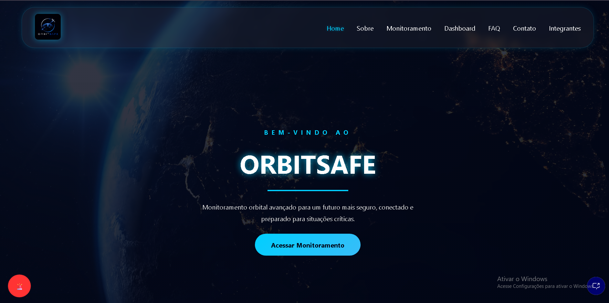

# 🛰️ OrbitSafe — Sistema de Conectividade Espacial e Emergências Climáticas

  

> Global Solution — Turma 1TDSPH (2026)  
> Projeto focado em conectividade via satélites de órbita baixa  para prevenção, monitoramento e resposta ágil a desastres ambientais.

---

  

## 📌 Descrição do Projeto

O OrbitSafe é uma plataforma front-end concebida para atuar na ameização dos impactos causados por desastres ambientais (enchentes, queimadas, deslizamentos, tempestades) em regiões remotas ou temporariamente isoladas. Quando a infraestrutura terrestre de telecomunicação (cabos de fibra e antenas de celular) colapsa, o OrbitSafe restabelece a troca de dados vitais roteando o tráfego por satélites de órbita baixa.

O ecossistema integra:
1. Central de Monitoramento: Radar ativo em tempo real demonstrando a telemetria e o posicionamento dos satélites parceiros.
2. Dashboard de Resiliência: Simulação de gráficos orbitais e informações. 
3. Módulo de Chamado Emergencial (SOS): Um modal flutuante validado via JavaScript para o envio ágil de coordenadas e solicitações de mantimentos/resgate diretamente por satélite.
4. Perguntas Frequentes (FAQ): Para orientar equipes no uso da plataforma em campo.

---

## 🚀 Tecnologias Utilizadas

A arquitetura foi inteiramente implementada utilizando tecnologias web fundamentais, garantindo leveza absoluta em conexões de baixa velocidade:

* HTML5: Estrutura semântica acessível, com tags estruturadas (`<header>`, `<nav>`, `<main>`, `<section>`, `<article>`, `<footer>`) e marcações ARIA para leitores de tela.
* CSS3: Estilização premium baseada em Dark Mode espacial, Layouts Flexbox e Grid altamente responsivos.
* JavaScript: Interatividade do menu mobile hamburger, lógica de accordion de FAQ e validação rigorosa com feedback visual dos formulário de SOS.

---

## 📁 Estrutura de Pastas

O repositório está organizado de forma modular, separando as preocupações globais de estilo das especificidades de cada página:

<pre>
ORBITSAFE/
├── assets/                       # Armazenamento de imagens e vídeos
│   ├── github.png                # Ícone do GitHub para links sociais   
│   ├── integranteIsabelle.png
│   ├── home.png
│   ├── integranteMarina.png
│   └── integranteMilena.png      
│   ├── linkedin.png              # Ícone do LinkedIn para links sociais
│   └── logo.png                  # Logotipo oficial do OrbitSafe
│   └── videoterra.mp4            # Vídeo de fundo/demonstração da Terra
├── css/                        
│   ├── contato.css               # Estilo do formulário de contato e feedbacks
│   ├── dashboard.css             # Estilo do painel de dados (gráficos, tabs, tabelas)
│   ├── faq.css                   # Estilo visual do FAQ
│   ├── home.css                  # Estilo específico da página Home
│   ├── integrantes.css           # Estilo dos cards de perfil e links sociais
│   ├── login.css                 # Estilo dos cards de login e cadastro
│   ├── main.css                  # Design system global
│   ├── monitoramento.css         # Estilo da Central de Monitoramento (radar e alertas)
│   └── sobre.css                 # Estilo específico da página Sobre
├── js/
│   └── script.js                 # Toda a lógica interativa e validações JavaScript
├── pages/                        # Páginas internas da plataforma
│   ├── contato.html              # Canal direto para suporte e parcerias
│   ├── dashboard.html            # Simulação estatísticas dashboard
│   ├── faq.html                  # Perguntas frequentes para auxílio
│   ├── integrantes.html          # Detalhes profissionais da equipe desenvolvedora
│   ├── login.html                # Login e cadastro de colaboradores
│   ├── monitoramento.html        # Simulação Telemetria ao vivo da constelação
│   └── sobre.html                # Nossa missão e valores humanitários
├── index.html                    # Página inicial (Hero & recursos do sistema)
└── README.md                     # Documentação técnica do projeto
</pre>

---

## 👥 Integrantes & Autores

Abaixo encontram-se os detalhes dos desenvolvedores responsáveis pela arquitetura e engenharia do OrbitSafe:

*  
  Isabelle Ferreira Neri Feitoza — RM 573507 (JavaScript General & UI) - Turma: 1TDSPH
  * [LinkedIn](https://www.linkedin.com/in/isabelle-ferreira-8844593ab/) | [GitHub](https://github.com/isabelleferreiraa)
*  
  Milena Silva Conegin — RM 568923 (HTML Semantics & UX) - Turma: 1TDSPH
  * [LinkedIn](https://www.linkedin.com/in/milena-conegin-996b22269?utm_source=share_via&utm_content=profile&utm_medium=member_ios) | [GitHub](https://github.com/MilenaConegin)
*  
  Marina Fernandes Gomes Mesquita — RM 571265 (Front-End Design & UX) - Turma: 1TDSPH
  * [LinkedIn](https://www.linkedin.com/in/marifernandesgm-58460a40a) | [GitHub](https://github.com/marifernandesgm)

---

## 🔗 Repositório Oficial
 
👉 **GitHub - OrbitSafe Repo(https://github.com/isabelleferreiraa/ORBITSAFE-Global-Solution)**

---

## 🛠️ Como Executar Localmente

1. Faça o clone deste repositório na sua máquina local:
   bash
   git clone https://github.com/isabelleferreiraa/ORBITSAFE-Global-Solution.git
   
2. Navegue até a pasta do projeto:
   bash
   cd ORBITSAFE
   
3. Abra o arquivo index.html em seu navegador favorito (utilizando a extensão Live Server no VS Code para uma melhor experiência com caminhos relativos).

## 📞 Contato

Para dúvidas, suporte técnico ou informações sobre o ecossistema OrbitSafe, entre em contato com a equipe de desenvolvimento através dos canais abaixo:

* **Dúvidas:** Abra uma [*Issue* diretamente no nosso repositório do GitHub](https://github.com/isabelleferreiraa/ORBITSAFE-Global-Solution.git)

---
OrbitSafe 2026 — Fiap Global Solution. Todos os direitos reservados.
